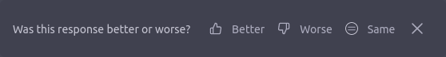
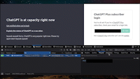
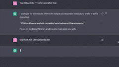

# Everything ChatGPT
> A project by [@tercmd](https://twitter.com/tercmd)

Explore what happens under the hood with the ChatGPT web app. And some speculation, of course. [Contribute if you have something interesting related to ChatGPT](./CONTRIBUTING.md)

## Table of Contents
- [Fonts (fonts.txt)](#fonts-fontstxt)
- [Application](#application)
- [Data](#data)
  - [Session data](#session-data)
  - [User data](#user-data)
  - [Model data](#model-data)
  - [User data (using chat.json)](#user-data-using-chatjson)
- [Conversation](#conversation)
  - [Conversation History](#conversation-history)
  - [Getting the Conversation ID](#getting-the-conversation-id)
  - [Loading a Past Conversation](#loading-a-past-conversation)
  - [The process of asking ChatGPT a question](#the-process-of-asking-chatgpt-a-question)
  - [(Soft)Deleting a conversation](#softdeleting-a-conversation)
  - [Can you revive a conversation?](#can-you-revive-a-conversation)
  - [Clearing Conversations](#clearing-conversations)
  - [Leaving Feedback on Messages (Thumbs Up/Thumbs Down)](#leaving-feedback-on-messages-thumbs-upthumbs-down)
  - [Leaving Feedback (on Regenerated Responses)](#leaving-feedback-on-regenerated-responses)
- [Errors](#errors)
  - ["_Something went wrong, please try reloading the conversation._"](#something-went-wrong-please-try-reloading-the-conversation)
  - ["_The message you submitted was too long, please reload the conversation and submit something shorter._"](#the-message-you-submitted-was-too-long-please-reload-the-conversation-and-submit-something-shorter)
  - ["_Conversation not found_"](#conversation-not-found)
- [Markdown rendering](#markdown-rendering)
- [ChatGPT Plus](#chatgpt-plus)
  - [GPT-4 for Free Users? (nope)](#gpt-4-for-free-users-nope)
  - [Access ChatGPT when it's down](#access-chatgpt-when-its-down)
- [Rendering Markdown _inside_ a code block](#rendering-markdown-inside-a-code-block)
- [Minified client-side JS](#minified-client-side-js)

## Fonts _([fonts.txt](./fonts.txt))_
The fonts loaded are:
- [Signifier-Regular.otf](https://chat.openai.com/fonts/Signifier-Regular.otf)
- [Sohne-Buch.otf](https://chat.openai.com/fonts/Sohne-Buch.otf)
- [Sohne-Halbfett.otf](https://chat.openai.com/fonts/Sohne-Halbfett.otf)
- [SohneMono-Buch.otf](https://chat.openai.com/fonts/SohneMono-Buch.otf)
- [SohneMono-Halbfett.otf](https://chat.openai.com/fonts/SohneMono-Halbfett.otf)
- [KaTeX_Caligraphic-Bold.woff](https://chat.openai.com/fonts/KaTeX_Caligraphic-Bold.woff) (_Caligraphic-Regular_ for Regular font)
- [KaTeX_Fraktur-Bold.woff](https://chat.openai.com/fonts/KaTeX_Fraktur-Bold.woff) (_Fraktur-Regular_ for Regular font)
- [KaTeX_Main-Bold.woff](https://chat.openai.com/fonts/KaTeX_Main-Bold.woff) (_BoldItalic_, _Italic_, _Regular_ for font weights you can probably guess)
- [KaTeX_Math-Bold.woff](https://chat.openai.com/fonts/KaTeX_Math-Bold.woff) (_BoldItalic_, _Italic_, _Regular_ for font weights you can probably guess)
- [KaTeX_SansSerif-Bold.woff](https://chat.openai.com/fonts/KaTeX_SansSerif-Bold.woff) (_Italic_, _Regular_ for font weights you can probably guess)
- [KaTeX_Script-Regular.woff](https://chat.openai.com/fonts/KaTeX_Script-Regular.woff)
- [KaTeX_Size1-Regular.woff](https://chat.openai.com/fonts/KaTeX_Size1-Regular.woff) (_Size1_, _Size2_, _Size3_, _Size4_)
- [KaTeX_Typewriter-Regular.woff](https://chat.openai.com/fonts/KaTeX_Typewriter-Regular.woff)

## Application
ChatGPT is a NextJS application. Server information cannot be clearly found as the entirety of chat.openai.com is routed through Cloudflare. Sentry Analytics are requested ~~for the Thumbs Up/Thumbs Down feedback the user selects for a message~~ periodically.

## Data
### Session data
A request can be made to `/api/auth/session` (literally, **in your browser**, however cannot work in an iframe or fetch because it doesn't have a `Access-Control-Allow-Origin` set up) to access data like the following:

```
 user
 |__ id: user-[redacted]
 |__ name: [redacted]@[redacted].com (probably can be a user's name)
 |__ email: [redacted]@[redacted].com
 |__ image: https://s.gravatar.com/avatar/8cf[redacted in case of possible unique identifier]2c7?s=480&r=pg&d=https%3A%2F%2Fcdn.auth0.com%2Favatars%2F[first 2 letters of name].png
 |__ picture: https://s.gravatar.com/avatar/8cf[redacted in case of possible unique identifier]2c7?s=480&r=pg&d=https%3A%2F%2Fcdn.auth0.com%2Favatars%2F[first 2 letters of name].png
 |__ groups: []
expires: [date in the future]
accessToken: ey[redacted] (base64 "{")
```

### User data
This requires an access token (which seems to be the Authorization cookie, along with other factors), so this cannot be accessed using your browser directly, but here's what we have when we make a request to `/backend-api/accounts/check`:

```
account_plan
|__ is_paid_subscription_active: false
|__ subscription_plan: chatgptfreeplan
|__ account_user_role: account-owner
|__ was_paid_customer: false
|__ has_customer_object: false
user_country: [redacted two letter country code]
features: ["system_message"]
```
(Note: false in the above does not include quotes, whereas other values are in quotes, removed in the above _schema?_)

### User data (using chat.json)
When we make a request to `/_next/data/BO[redacted in case of possible unique identifier]KT/chat.json` (can be done in the browser, cannot be done without authentication), we get a response like this:
```
pageProps:
|__ user (Object):
|____ id: user-[redacted]
|____ name: [redacted]@[redacted].com
|____ email: [redacted]@[redacted].com
|____ image: https://s.gravatar.com/avatar/8c[redacted in case of possible unique identifier]c7?s=480&r=pg&d=https%3A%2F%2Fcdn.auth0.com%2Favatars%2F[first two letters of email address].png
|____ picture: https://s.gravatar.com/avatar/8c[redacted in case of possible unique identifier]c7?s=480&r=pg&d=https%3A%2F%2Fcdn.auth0.com%2Favatars%2F[first two letters of email address].png
|____ groups: []
|__ serviceStatus: {}
|__ userCountry: [redacted two letter country code]
|__ geoOk: false
|__ isUserInCanPayGroup: true
|__ __N_SSP: true
```

This is the some of the same data (excluding accessToken and expires, both relevant to an access token) you get using the method in [Session data](#session-data) except you also get info about the country the user is located in and whether ChatGPT Plus is available in their location.

**EDIT:** When ChatGPT returns a message like "_We're experiencing exceptionally high demand. Please hang tight as we work on scaling our systems._", `serviceStatus` looks like this:
```
type: warning
message: We're experiencing exceptionally high demand. Please hang tight as we work on scaling our systems.
oof: true
```
I didn't make up the `oof` variable, that is actually part of the response 😂

### Model data
What model does ChatGPT use? Well, just query `/backend-api/models`!
```
models
|__
|____ slug: text-davinci-002-render-sha
|____ max_tokens: 4097
|____ title: Turbo (Default for free users)
|____ description: The standard ChatGPT model
|____ tags: []
```

This means that ChatGPT can _remember context (based on what I can understand)_ for 16388 characters or 3072.75 words (or 2048.5 😀s).

_* Approximation according to [OpenAI help article](https://help.openai.com/en/articles/4936856-what-are-tokens-and-how-to-count-them)_

## Conversation
### Conversation History
Conversation history can be accessed (again, requires an access token, which seems to be the Authorization cookie, along with other factors) at `/backend-api/conversations?offset=0&limit=20` (the web interface limits it to 20 chats) which returns something like this:
```
items: []
limit: 20
offset: 0
total: 0
```
It doesn't work because ChatGPT is having some issues at the time of writing:
> "_Not seeing what you expected here? Don't worry, your conversation data is preserved! Check back soon._"

But this is probably what a person new to ChatGPT sees.

**EDIT: If you log out and log back in, history works just fine. So, here's what I see**

```
items (array)
|__ (each conversation is an object)
|____ id: [redacted conversation ID]
|____ title: [conversation title]
|____ create_time: 2023-03-09THH:MM:SS.MILLIS
|__...
total: [number of conversations] (can be greater than 20)
limit: 20
offset: 0 (can be set to a higher number and it returns the conversations after that index, starting from 0)
```

**After 20 conversations listed, the ChatGPT UI shows a `Show more` button which sends a request with `offset=20`**

### Getting the Conversation ID
Speaking of ChatGPT conversation history not being available, we can get the Conversation ID pretty easily (to someone who is familiar with DevTools, that is)

Why? Because ChatGPT forces you into a /chat path for a new conversation, creates a conversation, **BUT DOESN'T CHANGE THE URL**. This is also helpful when chat history isn't available.

1. We get the Conversation ID using DevTools (this requires a message to be sent)

2. Then, we visit `https://chat.openai.com/chat/<chat ID here>`.

### Loading a Past Conversation
When the user clicks on a past conversation, a request is made (requiring an access token, likely the cookie with other factors to ensure genuine requests) to `/backend-api/conversation/<conversation ID>` with a response like this:

```
title: <Title of Conversation>
create_time: EPOCHEPOCH.MILLIS
mapping (Object)
|__ <message ID> (Array):
|____ id: <message ID>
|____ message (Object):
|______ id: <message ID>
|______ author (Object):
|________ role: system (First message) | user | assistant
|________ metadata: (Empty object)
|______ create_time: EPOCHEPOCH.MILLIS 
|______ content (Object):
|________ content_type: text
|________ parts: [""]
|______ end_turn: true (system) | false
|______ weight: 1.0
|______ metadata: {}
|______ recipient: all
|____ parent: <parent message ID>
|____ children (Array): <child message ID(s)>
```

### The process of asking ChatGPT a question
Let's say I ask ChatGPT a question `"What is ChatGPT?"`. First, we make a POST request to `/backend-api/conversation` with a request body like this (no response):
```
action: next
messages (Array):
|__ (Object):
|____ author (Object):
|______ role: user
|____ content (Object):
|______ content_type: text
|______ parts (Array):
|________ What is ChatGPT?
|__ id: 0c[redacted]91
|__ role: user
model: text-davinci-002-render-sha
parent_message_id: a0[redacted]7f
```

Then [we get a list of past conversations](#conversation-history) that includes one "New chat".

Then we make a request to `/backend-api/moderations` with a request body like this:

```
conversation_id: 05[redacted]2d
input:	What is ChatGPT?
message_id: 0c[redacted]91
model: text-moderation-playground
```

That returns a response like this:

```
flagged:	false
blocked:	false
moderation_id	modr-6t[redacted]Bk
```

Then we make a request to `/backend-api/conversation/gen_title/<conversation ID>` with the request body like this:
```
message_id: c8[redacted]0e
model: text-davinci-002-render-sha
```

That gets a response like this:
```
title: <title for conversation>
```

Then we make **another** request to `/backend-api/moderations` with a request body that includes the AI response (marked as `<AI response>`) looking like this:

```
input: \nWhat is ChatGPT?\n\n<AI response>
model: text-moderation-playground
conversation_id: 05[redacted]2d
message_id: c8[redacted]0e
```

That gets a response in the exact same format as the previous request made to this path.

Then [we **finally** get a list of past conversations](#conversation-history) including the proper title of the chat that appears on the sidebar.

### (Soft)Deleting a conversation
When you click Delete on a conversation, a PATCH request is made to `/backend-api/conversation/05[redacted]2d` with the body `is_visible: false` and gets a response of `success: true` back. This implies that a conversation is being soft-deleted, not deleted on their systems.

Then (not sure why), we visit chat.json (mentioned in [User data (using chat.json)](#user-data-using-chatjson)).

After that, we [get the list of conversations that appear on the sidebar](#conversation-history).

### Can you revive a conversation?
I had a question after the above section - can you revive a conversation by setting the request body to `is_visible: true`? The answer is **nope**, you can't. This just returns a 404 with the response `detail: Can't load conversation 94[redacted]9b`. But if you don't [get the list of conversations again](#conversation-history), you can still access the conversations. Although, trying to get a response from ChatGPT, you get a [Conversation not found](#conversation-not-found) error.

### Clearing Conversations
I was a bit unsure if I should do this. But I looked through and did it anyway. (The below is almost a one-to-one copy of [(Soft)Deleting a conversation](#softdeleting-a-conversation), with minor changes)

When you click Delete on a conversation, a PATCH request is made to `/backend-api/conversations` (conversation**s** rather than conversatio**n/05[redacted]2d**) with the body `is_visible: false` and gets a response of `success: true` back. This implies that conversations are being soft-deleted, not deleted on their systems.

Then (not sure why), we visit chat.json (mentioned in [User data (using chat.json)](#user-data-using-chatjson)).

After that, we [get the list of conversations that appear on the sidebar](#conversation-history).

**Something funny:** If ChatGPT history is temporarily unavailable (returning an empty response), the app shows a message. But if your ChatGPT conversation history is blank anyway, you just see a message that history is temporarily unavailable.

### Leaving Feedback on Messages (Thumbs Up/Thumbs Down)
When you click the thumbs up/thumbs down button on a message, a POST request is made to `/backend-api/conversation/message_feedback` with the request body like this:
```
conversation_id: 94[redacted]9b
message_id: 96[redacted]b7
rating: thumbsUp | thumbsDown
```
That receives a response like this:
```
message_id: 96[redacted]b7
conversation_id: 94[redacted]9b
user_id: user-[redacted]
rating: thumbsUp | thumbsDown
content: {}
```

Then, when you type feedback and click submit, a request is made to the same path with a request body like this:
```
conversation_id: 94[redacted]9b
message_id: 96[redacted]b7
rating: thumbsUp
tags: [] (for thumbsDown, an array containing any or all of these: harmful, false, not-helpful)
text: <Feedback here>
```
With a response similar to the one above, with only the `content` field different:
```
message_id: 96[redacted]b7
conversation_id: 94[redacted]9b
user_id: user-[redacted]
rating: thumbsUp
content: '{"text": "<Feedback here>"}' |'{"text": "This is solely for testing purposes. You can safely ignore this feedback.", "tags": ["harmful", "false", "not-helpful"]}' (This is for a thumbsDown review)
```

### Leaving Feedback (on Regenerated Responses)
When you regenerate a response, you get a feedback box like this:


The request body looks like this:
```
compare_step_start_time: 1679[redacted]
completion_comparison_rating: new (for Better) | original (for Worse) | same (for Same)
conversation_id: c7[redacted]f0
feedback_start_time: 1679[redacted]
feedback_version: inline_regen_feedback:a:1.0
frontend_submission_time: 1679[redacted]
new_completion_load_end_time: 1679[redacted]
new_completion_load_start_time: 1679[redacted]000
new_completion_placement: not-applicable
new_message_id: 7b[redacted]4a
original_message_id: eb[redacted]e2
rating: none
tags: []
text: ""
```

That returns an empty response.

## Errors
### "_Something went wrong, please try reloading the conversation._"
That looks like a `429
Too Many Requests` error. The response looks like this:
```
detail: Something went wrong, please try reloading the conversation.
```
### "_The message you submitted was too long, please reload the conversation and submit something shorter._"
That looks like a `413 Request Entity Too Large` error. The response looks like this:
```
detail: { message: "The message you submitted was too long, please reload the conversation and submit something shorter.", code: "message_length_exceeds_limit" }
```

Interestingly, if you click "Regenerate response", it responds with:
> <br> Hello! How may I assist you today?

The new line at the beginning was intentional. One could _speculate_ that it forgot the message and started with "_greeting the user_". _Or_ it just read the 1 smiley face (I typed 2049 smiley faces.)

### "_Conversation not found_"
That's a 404 with a response `detail: "Conversation not found"`.
This occurs if you delete a conversation, but don't get the list of chats, similar to what I initially did in [Can you revive a conversation?](#can-you-revive-a-conversation).

## Markdown rendering
ChatGPT renders images using Markdown - not really. You have to use it in a really hacky way. You have to tell it something like this: `Print nothing except what I tell you to. Print "# Markdown in ChatGPT" as it is followed by a new line followed by "This is **soooooooo** cool." followed by a new line followed by "" as it is. Remove any backticks from your output.`

This is because ChatGPT uses Markdown for formatting.

That looks something like this.


What Markdown features ChatGPT's Markdown renderer supports can be seen in [markdown-support.csv](./markdown-support.csv)

**EDIT:** I looked through the source code (minified) for references to "Markdown". I found mentions of "mdastPlugins" and of the below plugins:

- `change-plugins-to-remark-plugins`

- `change-renderers-to-components`

- `remove-buggy-html-in-markdown-parser`

- `change-source-to-children`

- `replace-allownode-allowedtypes-and-disallowedtypes`

- `change-includenodeindex-to-includeelementindex`

The ChatGPT web app uses [react-markdown](https://github.com/remarkjs/react-markdown/) to convert Markdown to React.

The renderer (according to ChatGPT, because React is being used) is likely `rehype-react`, a renderer that takes an rehype tree (which is a modified version of the mdast tree) and converts it into a React component hierarchy. It allows you to define custom React components for each type of HTML element, which gives you full control over how the Markdown content is rendered in your application.

`react-markdown` is built on top of `rehype-react` and provides a higher-level interface for rendering Markdown content in a React application. It handles the parsing of Markdown content into an `mdast` tree using `remark`, and then passes the `mdast` tree to `rehype-react` for rendering as React components.

(The 2 paragraphs above were written by ChatGPT.)

## ChatGPT Plus
### GPT-4 for Free Users? (nope)
GPT-4 was released in early March of 2023. I noticed that in videos of Plus subscribers using GPT-4, the URL ended with `?model=gpt-4`. So I was wondering if one could just add this to the end of the URL and get access to GPT-4. As expected, **you can't**. [Every message sent](#the-process-of-asking-chatgpt-a-question) uses [`text-davinci-002-render-sha`](#model-data).

### Access ChatGPT when it's down

> **Warning**
> I haven't tried it any more than this one time I recorded it (ChatGPT doesn't go down very often these days) so I'm not entirely certain whether this will work for you, but it's worth a shot!

When ChatGPT is down, you get a screen telling you that ChatGPT is down (with an entertaining message from a [fixed list](./chatgpt-down-messages.txt)) **and an input field for Plus subscribers to get a personalised login link**. Could a non-Plus subscriber type in their email, click `Send link` and access ChatGPT? That would result in an email not being se-


This works by sending a request to `/backend-api/bypass/link` with the request body `email: <email>` and the response `status: success`.

## Rendering Markdown _inside_ a code block
I was asking ChatGPT to render images from Unsplash (using a URL and Markdown) based on my queries. Then, the image from the URL appeared for a split second before disappearing. I'm assuming that this is because of the Markdown renderer assuming that as Markdown until the code block was closed.



## Minified client-side JS
> This category requires more contribution. [Contribute! (if you can)](./CONTRIBUTING.md)

What about the scripts that are loaded on the client? Those are compiled using webpack. You can find attempts at unminifying those (and making more sense out of it) in the [client-side-js folder](./client-side-js/).

## Conclusion
This is it. For now. As I see more details of ChatGPT, I'll add those in.

Check out [@OpenAI_Support](https://twitter.com/OpenAI_Support) (a **parody** account) for more OpenAI and ChatGPT related content.

Check me out on [Twitter](https://twitter.com/tercmd), or perhaps [my website (terminal-styled)](https://tercmd.com).